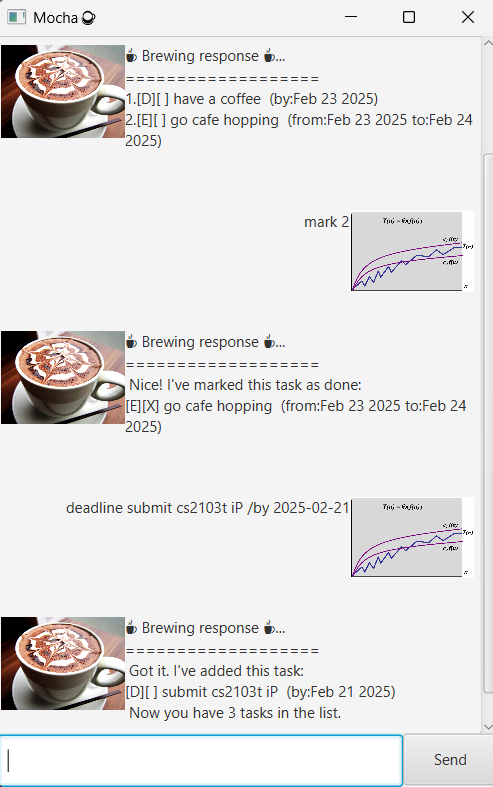

# Mocha User Guide



Mocha is an interactive bot which helps you to track your tasks. No longer worry about forgetting your tasks, let Mocha
do it for you!

> ☕**Fun fact**☕   
> The name mocha was inspired from javascript's old name

## Overview

Here is an overview of commands you can make, click on each to find out more!

| Command                     | What it does          |
|-----------------------------|-----------------------|
| [todo](#todo-tasks)         | adds a todo task      |
| [deadline](#deadline-tasks) | adds a deadline task  |
| [event](#event-tasks)       | adds a event task     |
| [list](#list)               | prints out task list  |
| [delete](#delete)           | deletes a task        |
| [mark](#mark)               | mark a task as done   |
| [unmark](unmark)            | unmark a task as done |
| [tag](#tag)                 | tag a task            |
| [untag](#untag)             | untag a task          |
| [find](#find)               | find a task           |

## Command Format
☕ Commands can be in both upper or lower case  
☕ Commands should be the first word in an input  
☕ Words in <brackets\> are parameters supplied by user  
☕ Commands with `/` should be followed accordingly

## Adding Tasks

There are 3 types of tasks you can add -- _todo_, _deadline_ and _event_ tasks to suit your needs!

### Todo Tasks

- Tasks that do not have any deadlines
- Command: `todo <task>`

Example: `todo have a coffee`

**Output**:

  ```md
  ☕ Brewing response ☕...  
  =========================  
  Got it, I've added this task:  
  [T][] have a coffee  
  Now you have 1 tasks in the list.
  ```

### Deadline Tasks

- Tasks that have to be completed by a deadline
  - Deadline can be formatted as `yyyy-MM-dd` or `yyyy-MM-dd HHmm`
- Command: `deadline <task> /by <deadline>`

Example: `deadline have a coffee /by 2025-02-23`

**Output**:

  ```md
  ☕ Brewing response ☕...
  =========================
  Got it, I've added this task: 
  [D][] have a coffee (by:Feb 23 2025)  
  Now you have 2 tasks in the list.
  ```


### Event Tasks

- Tasks that have a start and end date
  - Date can be formatted as `yyyy-MM-dd` or `yyyy-MM-dd HHmm`
  - Both start and end should follow the same format
- Command: `event <task> /from <start date> /to <end date>`

Example: `event go cafe hopping /from 2025-02-23 /to 2025-02-24`

**Output**:

  ```md
  ☕ Brewing response ☕...
  =========================
  Got it, I've added this task:
  [E][] have a coffee (from:Feb 23 2025 to: Feb 24 2025)
  Now you have 3 tasks in the list.
  ```


## List

- Prints the current tasks in the list
- Command: `list`

Example: `list`

**Output**:

  ```md
  ☕ Brewing response ☕...
  =========================
  1.[T][] have a coffee
  2.[D][] have a coffee (by:Feb 23 2025)
  3.[E][] have a coffee (from:Feb 23 2025 to: Feb 24 2025)
  ```


## Delete

- Removes the task at specified position on the list
- Command: `delete <number>`

Example: `delete 1`

**Output**:
  ```md
  ☕ Brewing response ☕...
  =========================
  Alright, I have removed this task:
  [T][] have a coffee
  ```


## Find

- Find a task based on keyword specified
  - Can find based on task's [tag](#tag)
- Command: find /keywords

Example: `find /a coffee`

**Output**:

  ```md
  ☕ Brewing response ☕...
  =========================
  Here are the matching tasks in your list:
  [D][] have a coffee (by:Feb 23 2025)
  ```

## Mark

- Mark a task as done based on number on list
- Command: `mark <task number>`

Example: `mark 1`

**Output**:

  ```md
  ☕ Brewing response ☕...
  =========================
  Nice! I've marked this task as done:
  [D][X] have a coffee (by:Feb 23 2025)
  ```


## Unmark

- Mark a task as done based on number on list
- Command: `unmark <task number>`

Example: `unmark 1`

**Output**:

  ```md
  ☕ Brewing response ☕...
  =========================
  OK, I've marked this task as not done yet:
  [D][] have a coffee (by:Feb 23 2025)
  ```


## Tag

- Tag a task with what you want
- Command: `tag <task number> /keyword`

Example: `tag 1 /important`

**Output**:

  ```md
  ☕ Brewing response ☕...
  =========================
  Tagged [D][] have a coffee # important (by:Feb 23 2025)
  ```

## Untag

- Tag a task with what you want
- Command: `untag <task number>`

Example: `untag 1`

**Output**:

  ```md
  ☕ Brewing response ☕...
  =========================
  Untagged [D][] have a coffee (by:Feb 23 2025)
  ```


